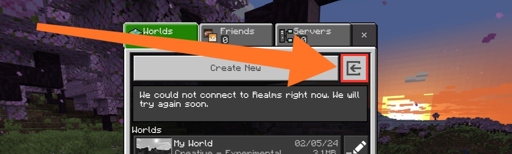

# World Porter

A simple texture pack to reveal the hidden world import and export buttons.

### Features

This pack is useful when you're transferring your worlds from "Application" to
"External Storage". This pack will show the following buttons:

- Import world button
- Export world button
- Export template button

This add-on has been tested and functions correctly with Minecraft: Bedrock
Edition 1.20.50 and above, expected to work with 1.18 and above.

### Screenshots

Import button:

Export world and template button:

### Installation

Follow these steps:

1. Download the texture pack from the [releases section][releases], choosing
   the version that matches your Minecraft version.
2. Import the texture pack into Minecraft.
3. Open Settings &#187; Global Resources, and activate the pack.
     

Now you're done setting it up!

### Contributing

Any contribution is greatly appreciated! Feel free to contribute to the add-on!

### License

Copyright &copy; 2024 Vincent Yanzee J. Tan. Licensed under the MIT License.
See [LICENSE](LICENSE) for more details.

[releases]: https://github.com/vytdev/world-porter/releases
